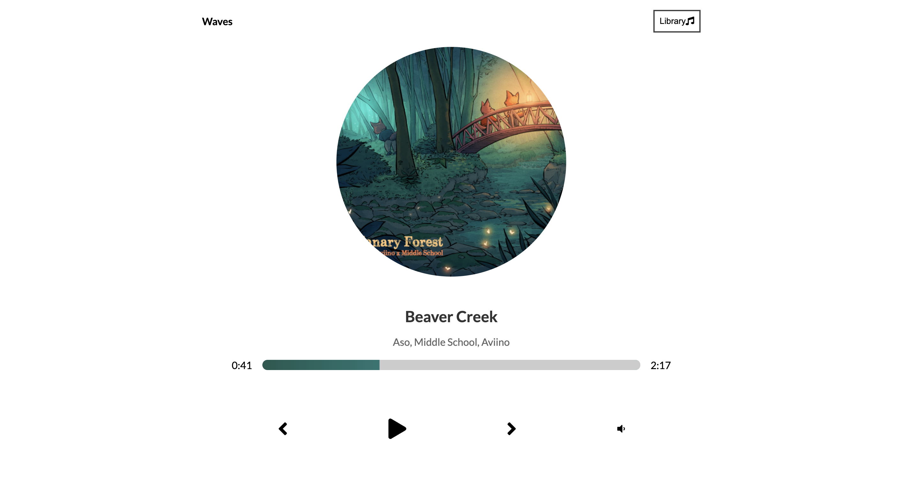
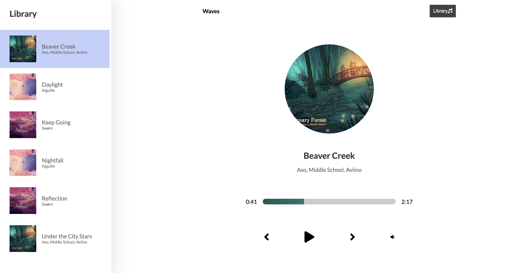

## Music Player with React 🎵
Music App React is a web application that allows users to explore, play music tracks. Built using React, the app provides a seamless and interactive user experience for music enthusiasts.

- a Music Player app as specified in the picture:

---

#Technologies Used

- React: JavaScript library for building user interfaces.
- React Router: Library for routing in React applications.
- Redux: State management library.
- Axios: Promise-based HTTP client for making API requests.
- Bootstrap: CSS framework for responsive design.

For any inquiries or feedback, please contact [smamedova5010@gmail.com] 
